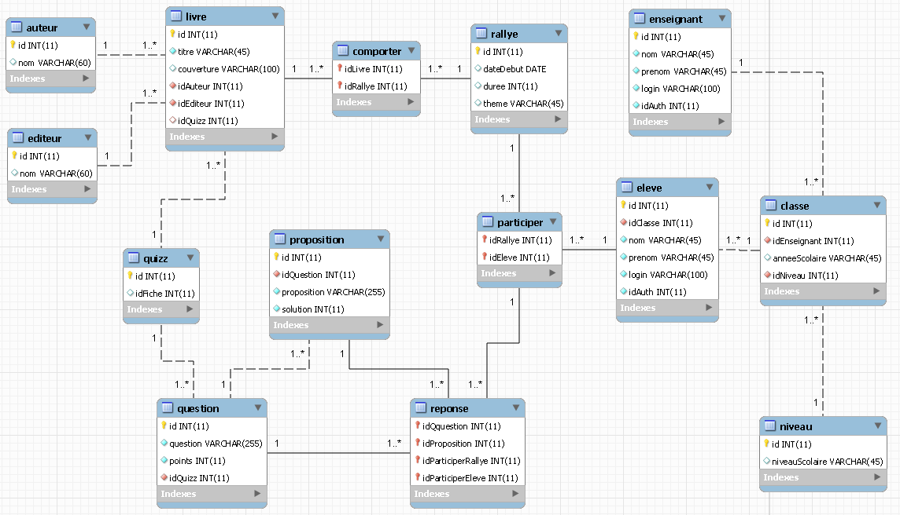
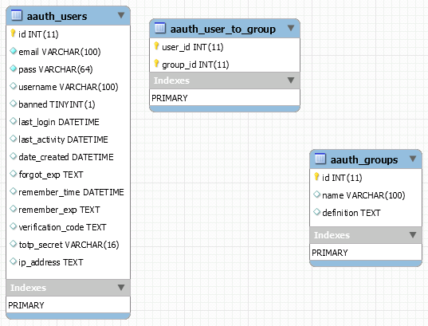

# Rallye Lecture : ppe situation initiale

[TOC]

Il s'agit de la situation initiale du ppe. Comportant d'une part le site web rallyeLecture ainsi que la librairie de gestion des droits d'accès.

#### 1. Mettez en place la base de données rallye lecture


#### 2. Tables liées à la gestion des autorisations.

les scripts de création des tables liées aux autorisations se trouvent dans le répertoire : [/sql/aauth](./sql/aauth)
>> Ces tables sont à créer directement dans la base *rallyeLecture*. Vous pouvez consulter la documentation liée à l'utilisation de la classe Aauth ici : [dépôt Aauth](https://github.com/emreakay/CodeIgniter-Aauth) et [wiki Aauth](https://github.com/magefly/CodeIgniter-Aauth/wiki/_pages).
Le code de la bibliothèque Aauth est déjà présent dans le dépôt rallyeLecture, vous n'avez pas à l'installer.

#### 3. Insérez les données exemples
On vous fournit le script d'insertion des données du jeu de test, disponible ici : [/sql/rl/insertTableRallyeLecture.sql](./sql/rl/). 
Donnez les droits à un compte administrateur de la base de données voici un script exemple : [/sql/rl/grant.sql](./sql/rl/).
>> les groupes d'utilisateurs "Enseignant" et "Elève" seront créés lors du premier lancement du site.

#### 4. Paramétrez l'accès à la base de données dans Code Igniter.
le fichier de configuration de l'accès à la base de données dans code igniter se trouve ici [/application/config/database.php](./application/config/)
vérifiez que les paramètres d'accès à la base de données sont cohérents avec votre environnement :
```php
    'hostname' => 'localhost',
    'username' => 'adminRallyeLecture',
    'password' => 'siojjr',
    'database' => 'rallyeLecture',
    'dbdriver' => 'mysqli',
```

#### 5. Accéder au site
>> Vous pouvez maintenant accéder au site web et consulter les différentes tables en utilisant le compte qui est créé automatiquement au lancement du site web : 
* user : admin@sio.jjr
* pwd  : siojjr